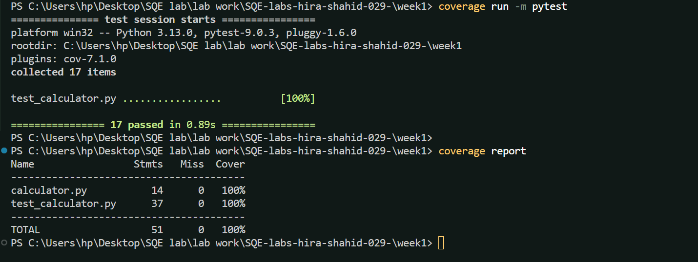
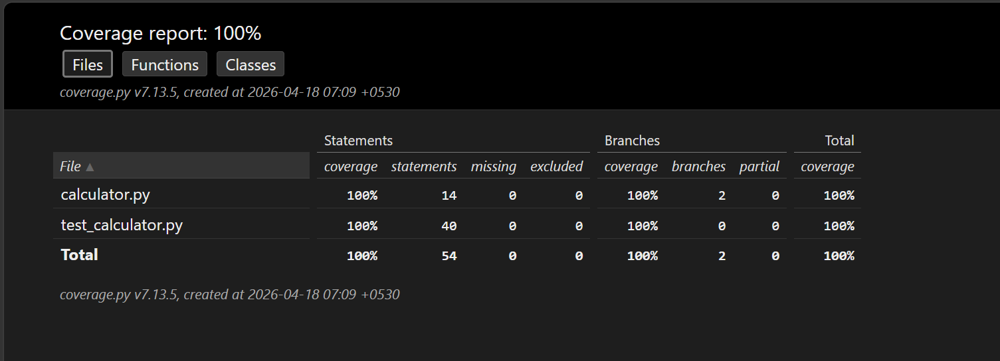

# Software Quality Engineering (SQE) - Lab

## Student Information
* **Name:** Hira Shahid
* **Roll No:** FA23-BSE-029
* **Section:** A
* **Semester:** 6th (2023-2027)
* **Task:** Lab 01 - Unit Testing & Code Coverage

---

## Week 1: Unit Testing with Pytest

### Project Overview
This week focuses on setting up a professional Python testing environment and implementing unit tests for a basic calculator module. The goal was to ensure software reliability through comprehensive test cases.

### Tasks Completed
* **Environment Setup:** Created a Virtual Environment (`.venv`) to manage project-specific dependencies.
* **Tooling:** Installed and configured `pytest` for testing and `coverage.py` for quality metrics.
* **Development:** Implemented `calculator.py` with core arithmetic operations and utility functions.
* **Testing:** Developed `test_calculator.py` including 17 test cases to handle positive, negative, floating-point, and edge cases.

### Test Coverage Results
The project achieved **100% code coverage**, ensuring every logical branch was tested.



| Module | Statements | Missed | Coverage |
| :--- | :---: | :---: | :---: |
| `calculator.py` | 14 | 0 | 100% |
| `test_calculator.py` | 37 | 0 | 100% |
| **Total** | **51** | **0** | **100%** |

---
### **A. Failure Simulation (Experiment B.6)**
To understand how Pytest handles bugs, I deliberately introduced a logical error in the `add()` function.

* **Bug Introduced:** `return a + b + 1`
* **Result:** Pytest caught the error and showed an `AssertionError`.
 ## **Output[screenshots]**


### **B. Test Markers & Grouping (Experiment B.7)**
In this experiment, I used Pytest markers (`@pytest.mark.arithmetic`) to categorize specific tests. This allows us to run a subset of the test suite instead of the whole project.

* **Action:** Marked 3 addition-related tests as `arithmetic`.
* **Command:** `pytest -v -m arithmetic`
* **Observation:** Pytest correctly identified and executed only the **3 selected** tests, while **14** others were deselected.
 ## **Output[screenshots]**


### **C. HTML Coverage Report (Experiment C.2)**
Generated an interactive HTML report to visualize code execution flow and branch coverage.
* **Branch Coverage:** Enabled to verify all decision-making paths.
* **Outcome:** 100% Statement and Branch coverage verified.
  ## **Output[screenshot]**


### How to Run Locally
1. **Activate Virtual Environment:**
   ```powershell
   .\.venv\Scripts\activate