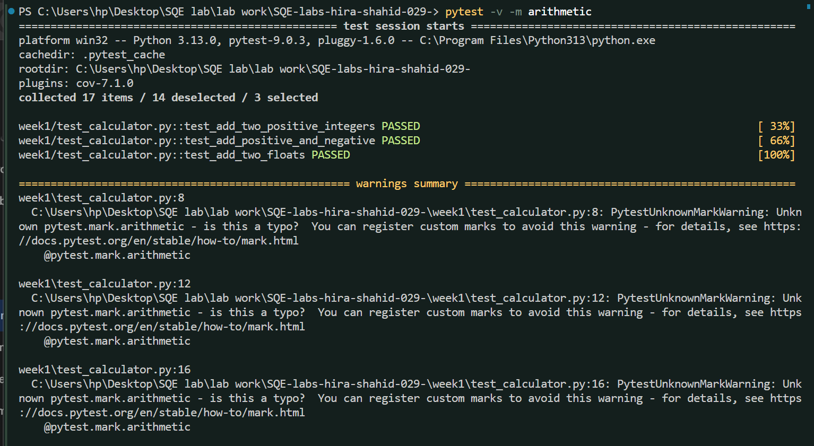
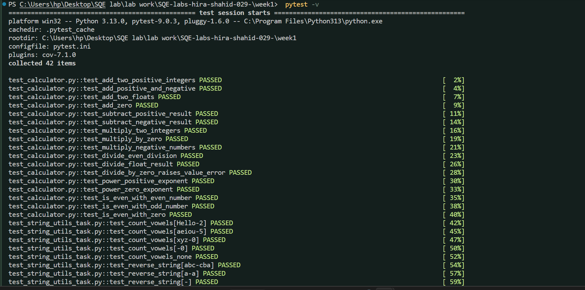
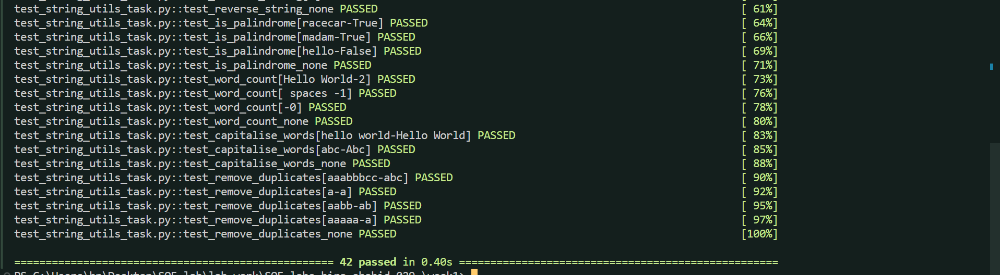
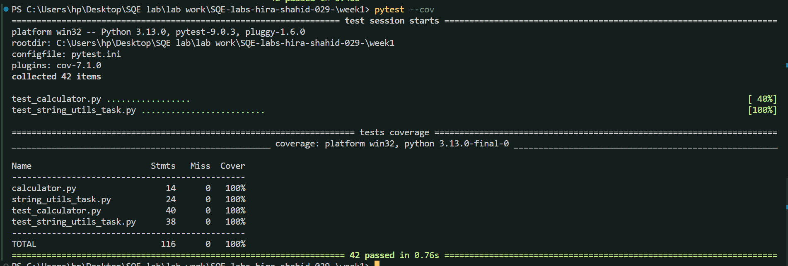
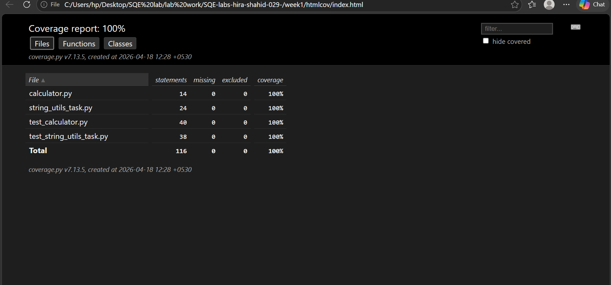

# Software Quality Engineering (SQE) - Lab

## Student Information
* **Name:** Hira Shahid
* **Roll No:** FA23-BSE-029
* **Section:** A
* **Semester:** 6th (2023-2027)
* **Task:** Lab 01 - Unit Testing & Code Coverage

---
# Week 1: Unit Testing and Code Coverage

This repository contains the completed tasks for **Week 1**, focusing on writing unit tests using `pytest` for different Python modules.

## Project Overview
The lab covers the development of two main modules and their corresponding unit tests:
1. **Calculator Module**: Handles arithmetic operations (add, subtract, multiply, divide, power) and checks for even numbers.
2. **String Utilities Module**: Handles string processing (vowels counting, reversing, palindrome check, word count, capitalization, and removing duplicates).

## File Structure
- `calculator.py`: Implementation of calculator functions.
- `test_calculator.py`: Unit tests for calculator.
- `string_utils.py`: Implementation of string utility functions.
- `test_string_utils_task.py`: Unit tests for string utilities.
- `pytest.ini`: Configuration file for pytest markers.

 ## **Task 1: Calculator Module**

Development:
 Implemented calculator.py with core arithmetic operations and utility functions.

## **Testing:**
 Developed test_calculator.py including 17 test cases to handle positive, negative, floating-point, and edge cases.
---
### **A. Failure Simulation (Experiment B.6)**
To understand how Pytest handles bugs, I deliberately introduced a logical error in the `add()` function.

* **Bug Introduced:** `return a + b + 1`
* **Result:** Pytest caught the error and showed an `AssertionError`.
 ## **Output[screenshots]**


### **B. Test Markers & Grouping (Experiment B.7)**
In this experiment, Pytest markers  are used(`@pytest.mark.arithmetic`) to categorize specific tests. This allows us to run a subset of the test suite instead of the whole project.

* **Action:** Marked 3 addition-related tests as `arithmetic`.
* **Command:** `pytest -v -m arithmetic`
* **Observation:** Pytest correctly identified and executed only the **3 selected** tests, while **14** others were deselected.
 ## **Output[screenshots]**


---------------------------------------------------------------------------------------
## Task 2: String Utilities Module

## **Development:** 
Implemented string_utils.py containing robust string processing functions (vowel counting, reversing, palindrome checks, word counting, capitalization, and duplicate removal).

## **Testing:**
 Developed test_string_utils.py featuring parameterized tests and exception handling for None inputs, ensuring 100% functionality coverage.



---------------------------------------------------------------------------------------
### Test Coverage Results


| Module | Statements | Missed | Coverage |
| :--- | :---: | :---: | :---: |
| `calculator.py` | 14 | 0 | 100% |
| `test_calculator.py` | 40 | 0 | 100% |
| `string_utils_task.py` | 24 | 0 | 100% |
| `test_string_utils_task.py` | 38 | 0 | 100% |
| **Total** | **116** | **0** | **100%** |


### **HTML Coverage Report for both tasks  (Experiment C.2)**
Generated an interactive HTML report to visualize code execution flow and branch coverage.
* **Branch Coverage:** Enabled to verify all decision-making paths.
* **Outcome:** 100% Statement and Branch coverage verified.
  ## **Output[screenshot]**

----
### How to Run Locally
1. **Activate Virtual Environment:**
   ```powershell
   .\.venv\Scripts\activate